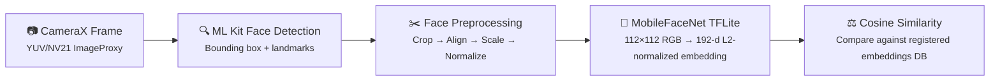

# Real-Time Face Recognition — Android

An offline Android app that performs real-time face recognition using **MobileFaceNet** (TensorFlow Lite). Register faces via camera or gallery, then identify people in a live camera feed — no server, no re-training required.
---

## Features

- **1:N Face Recognition** — identify any registered face in real-time from a live camera feed
- **1:1 Face Verification** — verify a live face against a specific registered identity
- **Face Registration** — add faces from camera or gallery with no model retraining
- **Fully Offline** — all inference runs on-device using TFLite, no network required
- **Real-Time Metrics** — per-frame breakdown of detection, preprocessing, embedding, and similarity timing
- **Adjustable Threshold** — tune the matching confidence threshold from settings
- **Developer Mode** — detailed performance overlay with FPS and per-step latency
- **Modern UI** — Jetpack Compose with Material 3, Lottie splash animation

---

## Face Recognition Pipeline



### Step-by-step

1. **CameraX** captures a frame and delivers it as an `ImageProxy` to the analysis callback.
2. **ML Kit Face Detection** detects faces and returns bounding boxes with eye landmarks.
3. **Face Preprocessing** (`FacePreprocessor`) — the bounding box is expanded with a 30% margin, the face is cropped, then **aligned** using a similarity transform computed from the two eye positions and reference eye coordinates. The result is scaled to **112×112** and normalized (mean=127.5, std=128).
4. **Embedding Extraction** (`FaceEmbeddingExtractor`) — the preprocessed `ByteBuffer` is fed into the **MobileFaceNet** TFLite model, which outputs a **192-dimensional** embedding. The vector is **L2-normalized**.
5. **Face Verification** (`FaceVerifier`) — **cosine similarity** is computed between the live embedding and all stored embeddings. The best match above the configurable threshold is returned as the recognized identity.

---

## Tech Stack

| Component | Technology |
|-----------|-----------|
| Language | Kotlin |
| UI | Jetpack Compose (Material 3) |
| Architecture | MVVM (ViewModel + Repository) |
| DI | Hilt |
| Camera | CameraX 1.4.1 |
| Face Detection | ML Kit Face Detection 16.1.7 |
| Inference | LiteRT (TensorFlow Lite) 1.4.0 |
| Model | MobileFaceNet — 112×112 input, 192-d output |
| Persistence | Binary files (`filesDir/face_embeddings/`), DataStore Preferences |
| Async | Kotlin Coroutines + Flow |
| Navigation | Navigation Compose |
| Animation | Lottie Compose |

---

## Useful References

- [MobileFaceNets Paper (arXiv 1804.07573)](https://arxiv.org/abs/1804.07573)
- [MobileFaceNet TensorFlow Implementation](https://github.com/sirius-ai/MobileFaceNet_TF)
- [TensorFlow Lite for Android](https://www.tensorflow.org/lite/android)
- [ML Kit Face Detection](https://developers.google.com/ml-kit/vision/face-detection)
- [CameraX Overview](https://developer.android.com/training/camerax)
- [Jetpack Compose](https://developer.android.com/compose)

---

## Developer Guide

### Prerequisites

- Android Studio Hedgehog or newer
- JDK 17
- Android device or emulator (API 24+)
- Camera permission (requested at runtime)

### Build & Run

```bash
# Clone the repo
git clone https://github.com/chawza/Real-Time_Face_Recognition_Android.git

# Build debug APK
./gradlew assembleDebug

# APK output
# app/build/outputs/apk/debug/app-debug.apk
```

Or open the project in Android Studio, sync Gradle, and hit Run.

### Project Structure

```
app/src/main/kotlin/com/atharvakale/facerecognition/
├── App.kt                          # @HiltAndroidApp — initializes TFLite on startup
├── MainActivity.kt                 # Single Activity, Compose entry point
├── data/
│   ├── model/RegisteredFace.kt     # Domain model: name + 192-d embedding
│   ├── datastore/SettingsRepository.kt  # DataStore (threshold, dev mode)
│   ├── FaceEmbeddingStorage.kt     # Binary file read/write for embeddings
│   └── FaceRepository.kt           # Storage wrapper, exposes Flow
├── ml/
│   ├── FaceDetectionAnalyzer.kt    # ImageAnalysis.Analyzer + ML Kit
│   ├── FaceEmbeddingExtractor.kt   # TFLite interpreter, L2 normalization
│   ├── FacePreprocessor.kt         # Crop, align, scale, normalize utilities
│   └── FaceVerifier.kt             # Cosine similarity matching
├── ui/
│   ├── navigation/NavGraph.kt      # Compose navigation
│   ├── screens/                    # Menu, Recognition, Verification, Database
│   ├── components/                 # CameraPreview, MetricsPanel, Dialogs
│   └── theme/                      # Material 3 theme
├── viewmodel/                      # RecognitionViewModel, VerificationViewModel, etc.
└── di/                             # Hilt modules (DataStore, Inference)
```

### Adding a New Screen

1. Create a composable in `ui/screens/`.
2. Create a `UiState` data class and a `@HiltViewModel` in `viewmodel/`.
3. Add a route in `ui/navigation/NavGraph.kt`.
4. Expose state via `StateFlow` and collect with `collectAsState()`.

### Key Conventions

- **Bitmap recycling** — `FacePreprocessor` methods recycle source bitmaps. Preserve this to avoid leaks.
- **ImageProxy lifecycle** — `imageProxy.close()` must always be called (handled in `FaceDetectionAnalyzer`).
- **No `.tflite` compression** — the `aaptOptions { noCompress "tflite" }` rule in `build.gradle` must remain.
- **Model dimensions** — `INPUT_SIZE = 112` and `OUTPUT_SIZE = 192` are tied to the bundled model. Changing them requires replacing the model file.

## Contributing

Pull requests are welcome. For major changes, please open an issue first to discuss what you would like to change.

---

## Acknowledgements

This project is a fork of [atharvakale31/Real-Time_Face_Recognition_Android](https://github.com/atharvakale31/Real-Time_Face_Recognition_Android) by Atharva Kale. The original project provided the foundation including the CameraX integration, ML Kit face detection pipeline, and MobileFaceNet TFLite setup. This fork modernizes the codebase with Kotlin, Jetpack Compose, Hilt DI, MVVM architecture, face alignment preprocessing, and per-frame performance metrics.
