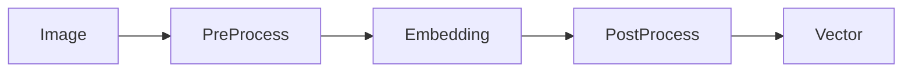

## Embedding Pipeline


## Image
- Red, Green, Blue (RGB) image
- aligned face portrait after face detection
- Cropped RGB image (112 x 112)

## Pre Processing
- Channel order: R, G, B extracted from Android ARGB int pixel
- Pixel normalization from Integer (0 - 255) to float32
- each pixel value will be ranging -1.0 to 1.0
```
normalized = (pixel - 127.5) / 128.0
```
 
## Embedding
- MobileFaceNet

## Post Processing
- L2 Normalization

## Vector
- 1 x 192 vector data