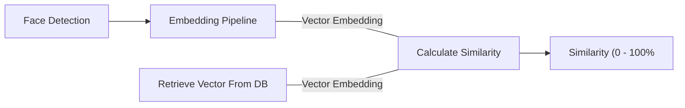

# Face Verification 
compare one sample to another sample image (1:1)

```mermaid
flowchart LR
    A["Face Detection"] --> B["Embedding Pipeline"]
    B ---|"Vector Embedding"| D["Calculate Similarity"]
    A2["Retrieve Vector From DB"] ---|"Vector Embedding"| D
    D --> E["Similarity (0 - 100%"]
```
